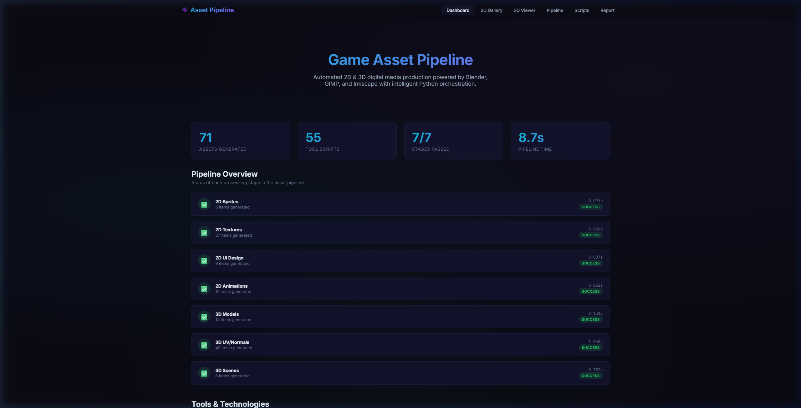
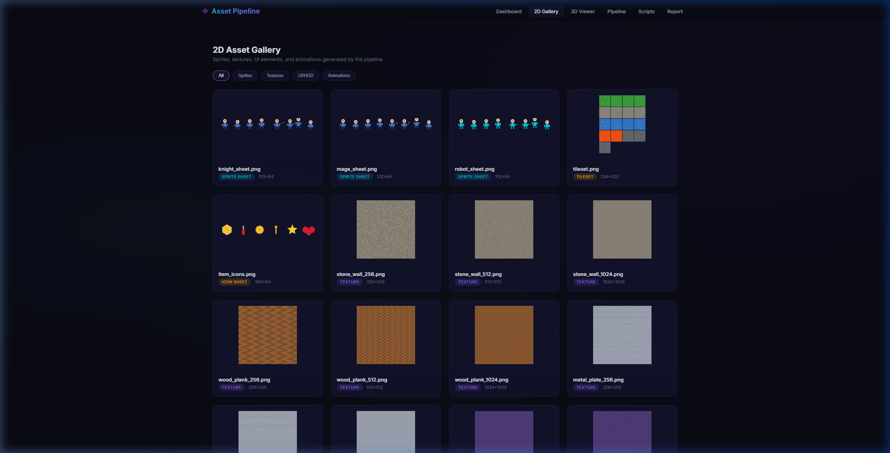
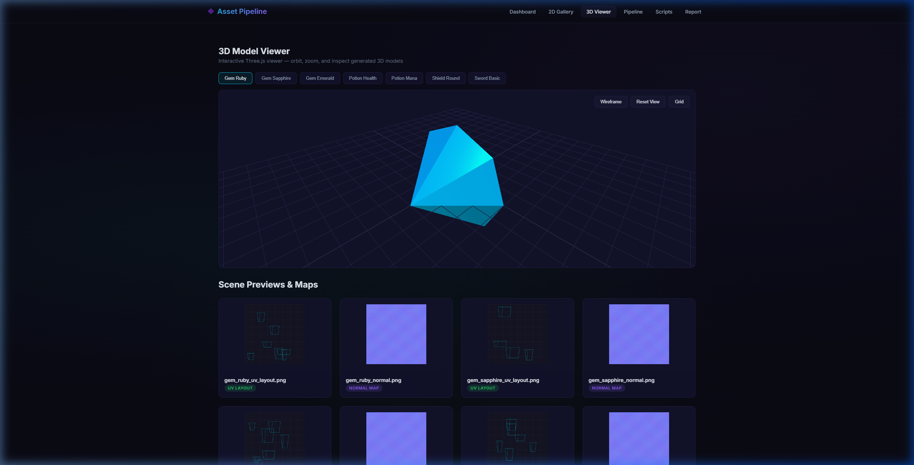
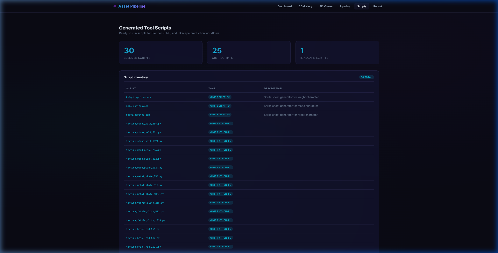

# 🎮 Game Asset Pipeline

**Automated 2D & 3D game asset production** using Blender, GIMP, and Inkscape with Python orchestration and a premium web dashboard.

> **[🌐 Live Demo →](https://1fanya.github.io/game-asset-pipeline/)**

---

## 📸 Preview

| Dashboard | 2D Gallery | 3D Viewer | Scripts |
|-----------|------------|-----------|---------|
|  |  |  |  |

---

## ✨ Features

### 2D Pipeline (GIMP + Inkscape)
- **Sprite Generator** — Character sprite sheets with animation frames + GIMP Script-Fu batch scripts
- **Texture Processor** — 6 procedural texture types, multi-resolution atlas packing + GIMP Python-Fu scripts
- **UI Designer** — Inkscape SVG game UI/HUD elements with multi-DPI export batch scripts
- **Animation Exporter** — Frame-by-frame VFX sequences (rotation, pulse, particles, shield) + GIF previews

### 3D Pipeline (Blender)
- **Parametric Modeler** — Blender Python scripts for gems, potions, weapons, terrain + numpy-stl fallback
- **UV/Texture System** — Smart UV Project scripts with PBR material setup + Sobel normal maps
- **Scene Compositor** — Multi-object scenes with dramatic/studio/warm lighting presets

### Web Dashboard
- Premium dark glassmorphism theme with **interactive Three.js 3D model viewer**
- 2D asset gallery with category filtering
- Pipeline metrics with animated progress bars
- Auto-generated technical report
- Tool script reference with usage examples

---

## 🚀 Quick Start

```bash
# Install dependencies
pip install -r requirements.txt

# Run the full pipeline
python main.py generate

# Launch the web dashboard
python main.py serve

# Or do both
python main.py all
```

Dashboard: **http://localhost:5000**

---

## 🛠️ Tool Integration

| Tool | Purpose | Script Type | Count |
|------|---------|-------------|-------|
| **Blender** | 3D modeling, UV, materials, rendering | Python (`bpy`) | 30 |
| **GIMP** | Sprite processing, texture filters | Script-Fu / Python-Fu | 25 |
| **Inkscape** | Vector UI elements, multi-DPI export | CLI batch (`.bat`) | 1 |

### Running Generated Scripts

```bash
# Blender (headless)
blender --background --python output/scripts/blender/model_gem_ruby.py

# GIMP (batch)
gimp -i -b '(script-fu-load "output/scripts/gimp/knight_sprites.scm")' -b '(gimp-quit 0)'

# Inkscape (CLI export)
output\scripts\inkscape_export.bat
```

---

## 📊 Pipeline Performance

| Stage | Items | Time |
|-------|-------|------|
| 2D Sprites | 8 | 0.09s |
| 2D Textures | 37 | 6.63s |
| 2D UI Design | 9 | 0.01s |
| 2D Animations | 12 | 0.05s |
| 3D Models | 14 | 0.13s |
| 3D UV/Normals | 40 | 1.05s |
| 3D Scenes | 6 | 0.73s |
| **Total** | **126** | **8.69s** |

---

## 📁 Project Structure

```
2D_3D/
├── main.py                    # CLI entry point
├── config.yaml                # Pipeline configuration
├── requirements.txt           # Python dependencies
├── pipeline_2d/               # 2D asset pipeline
│   ├── sprite_generator.py    # Sprites + GIMP Script-Fu
│   ├── texture_processor.py   # Textures + GIMP Python-Fu
│   ├── ui_designer.py         # SVGs + Inkscape CLI
│   └── animation_export.py    # Animations + GIMP scripts
├── pipeline_3d/               # 3D asset pipeline
│   ├── blender_modeler.py     # Models + Blender Python
│   ├── blender_uv_textures.py # UV/normals + Blender scripts
│   └── blender_scenes.py      # Scenes + Blender rendering
├── automation/                # Pipeline orchestration
│   ├── pipeline_runner.py     # Master runner
│   └── report_generator.py    # Markdown report generator
├── dashboard/                 # Flask web dashboard
│   ├── app.py                 # Flask routes
│   ├── templates/             # Jinja2 templates (6 pages)
│   └── static/css/            # Dark glassmorphism theme
├── docs/                      # GitHub Pages static site
│   ├── index.html             # Single-page portfolio app
│   └── assets/                # Static assets for live demo
└── output/                    # Generated assets (126 files)
```

---

## 📊 Technologies

- **Python 3.10+** — Pipeline orchestration
- **Pillow / NumPy** — Image generation, procedural textures, normal maps
- **numpy-stl / trimesh** — 3D mesh generation (STL/OBJ)
- **matplotlib** — 3D scene preview rendering
- **Flask / Jinja2** — Web dashboard
- **Three.js** — Browser-based 3D model viewer
- **YAML** — Configuration management

---

*Built as a portfolio project for 2D & 3D Digital Media Specialist roles.*
